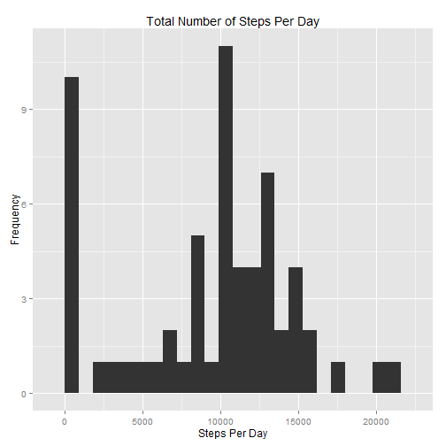
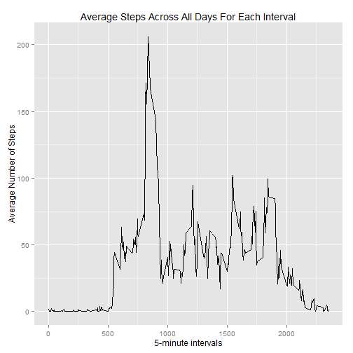
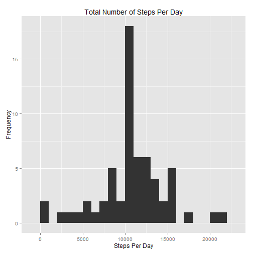
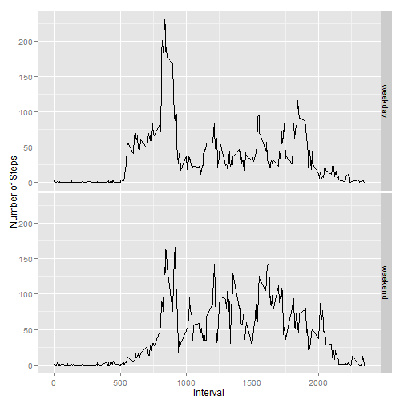

"Reproducible Research: Peer Assessment 1"
===========================================================================================

This assignment makes use of data from a personal activity monitoring device. This device collects data at
5 minute intervals through out the day. The data consists of two months of data from an anonymous
individual collected during the months of October and November, 2012 and include the number of steps
taken in 5 minute intervals each day.


# Data
The data consists of a csv file called **activity.csv**, contained a a zip file called **activity.zip**. 
The original file was downloaded from:  [Activity monitoring data](https://d396qusza40orc.cloudfront.net/repdata%2Fdata%2Factivity.zip)

The variables included in this dataset are:

. steps: Number of steps taking in a 5-minute interval (missing values are coded as NA)

. date: The date on which the measurement was taken in YYYY-MM-DD format

. interval: Identifier for the 5-minute interval in which measurement was taken

There are a total of 17,568 observations in this dataset.


# Loading the data

```r
unzip(zipfile="activity.zip")
data <- read.csv("activity.csv")
head(data, 10)
```

```
##    steps       date interval
## 1     NA 2012-10-01        0
## 2     NA 2012-10-01        5
## 3     NA 2012-10-01       10
## 4     NA 2012-10-01       15
## 5     NA 2012-10-01       20
## 6     NA 2012-10-01       25
## 7     NA 2012-10-01       30
## 8     NA 2012-10-01       35
## 9     NA 2012-10-01       40
## 10    NA 2012-10-01       45
```

```r
summary(data)
```

```
##      steps                date          interval     
##  Min.   :  0.00   2012-10-01:  288   Min.   :   0.0  
##  1st Qu.:  0.00   2012-10-02:  288   1st Qu.: 588.8  
##  Median :  0.00   2012-10-03:  288   Median :1177.5  
##  Mean   : 37.38   2012-10-04:  288   Mean   :1177.5  
##  3rd Qu.: 12.00   2012-10-05:  288   3rd Qu.:1766.2  
##  Max.   :806.00   2012-10-06:  288   Max.   :2355.0  
##  NA's   :2304     (Other)   :15840
```

```r
str(data)
```

```
## 'data.frame':	17568 obs. of  3 variables:
##  $ steps   : int  NA NA NA NA NA NA NA NA NA NA ...
##  $ date    : Factor w/ 61 levels "2012-10-01","2012-10-02",..: 1 1 1 1 1 1 1 1 1 1 ...
##  $ interval: int  0 5 10 15 20 25 30 35 40 45 ...
```
  
  
# What is mean total number of steps taken per day?
- Make a histogram of the total number of steps taken each day:

```r
library(ggplot2)
#Get the total steps
total_steps <- tapply(data$steps, data$date, FUN=sum, na.rm=TRUE) 

#Plot the  histogram
qplot(total_steps, binwidth=900, xlab="Steps Per Day", 
      ylab="Frequency", main="Total Number of Steps Per Day")
```

 
  
- Calculate and report the **mean** and **median** total number of steps taken per day:

```r
mean_steps <- mean(total_steps, na.rm=TRUE)
median_steps <- median(total_steps, na.rm=TRUE)
```
  
The **mean** number of daily steps is 9354.23 and the **median** is 10395.  
  
  
# What is the average daily activity pattern?
- Make a time series plot (i.e. `type = "l"`) of the 5-minute interval (x-axis) and the average number of steps taken, averaged across all days (y-axis):

```r
avg_steps <- aggregate(x=list(AvgSteps=data$steps), by=list(Interval=data$interval),FUN=mean, na.rm=TRUE)
```

```r
ggplot(data=avg_steps, aes(x=Interval, y=AvgSteps)) +
    geom_line() +
    xlab("5-minute intervals") +
    ylab("Average Number of Steps") +
    ggtitle("Average Steps Across All Days For Each Interval")
```

 
  
- Which 5-minute interval, on average across all the days in the dataset, contains the maximum number of steps?

```r
max_interval <- avg_steps[which.max(avg_steps$AvgSteps), ]
```
  
The 5 minute interval at 835 contains the greatest number of steps on average with value 206.17.


# Imputing missing values

- Calculate and report the total number of missing values in the dataset (i.e. the total number of rows with `NA`s):

```r
missing <- is.na(data$steps)
missing_values_count = with(data, sum(is.na(steps)))
```
The total number of missing values is 2304.
  
  
- Devise a strategy for filling in all of the missing values in the dataset. The strategy does not need to be sophisticated. For example, you could use the mean/median for that day, or the mean for that 5-minute interval, etc:

```r
# Replace the missing values with the mean value of its 5-minute interval
filling <- function(x, y) {
    fill <- NA
    if (!is.na(x))
        fill <- x
    else
        fill <- avg_steps[avg_steps$Interval==y, "AvgSteps"]
    return(fill)
    }

data_fixed <- data
data_fixed$steps <- mapply(filling, data_fixed$steps, data_fixed$interval)
```
  
- Make a histogram of the total number of steps taken each day and Calculate and report the **mean** and **median** total number of steps taken per day. Do these values differ from the estimates from the first part of the assignment? What is the impact of imputing missing data on the estimates of the total daily number of steps?


```r
sum_filled <- tapply(X = data_fixed$steps, INDEX = data_fixed$date, FUN=sum)
qplot(sum_filled, binwidth=1000, xlab="Steps Per Day", 
      ylab="Frequency", main="Total Number of Steps Per Day")
```

 

```r
mean(sum_filled)
```

```
## [1] 10766.19
```

```r
median(sum_filled)
```

```
## [1] 10766.19
```
  
After replacing the missing values, the mean and the median are higher. This is because when the NAs were omitted, the sum of the steps for these days resulted 0. Now, with the mean, the sum resulted greater than 0.


### Are there differences in activity patterns between weekdays and weekends?

- Create a new factor variable in the dataset with two levels -- "weekday" and "weekend" indicating whether a given date is a weekday or weekend day.


```r
#set the locale to English to prevents errors with the Weekdays fntion on other languages
Sys.setlocale("LC_TIME", "English")
```

```
## [1] "English_United States.1252"
```

```r
data_fixed$date <- as.Date(data_fixed$date)
week <- function(x) {
    day <- weekdays(x)
    if (day %in% c("Monday", "Tuesday", "Wednesday", "Thursday", "Friday"))
        return("weekday")
    else if (day %in% c("Saturday", "Sunday"))
        return("weekend")
    }

data_fixed$day <- sapply(X=data_fixed$date, FUN=week)
```
  
- Make a panel plot containing a time series plot (i.e. `type = "l"`) of the 5-minute interval (x-axis) and the average number of steps taken, averaged across all weekday days or weekend days (y-axis). The plot should look something like the following, which was created using **simulated data**:


```r
avg_steps2 <- aggregate(steps ~ interval + day, data=data_fixed, FUN=mean)
# Mean of steps for each combination of interval and day (weekday and weekend)
ggplot(avg_steps2, aes(interval, steps)) + 
    geom_line() + 
    facet_grid(day ~ .) +
    xlab("Interval") + 
    ylab("Number of Steps")
```

 
